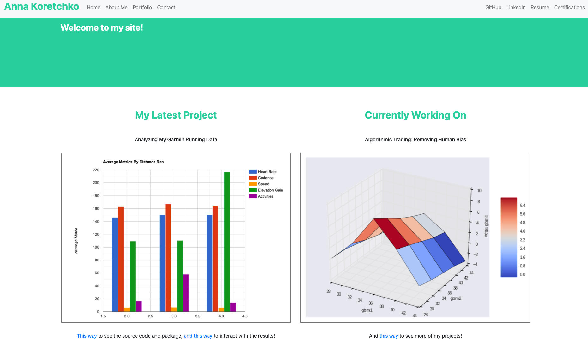

<!--
*** Thanks for checking out the Best-README-Template. If you have a suggestion
*** that would make this better, please fork the repo and create a pull request
*** or simply open an issue with the tag "enhancement".
*** Thanks again! Now go create something AMAZING! :D
-->

<!-- PROJECT SHIELDS -->
<!--
*** I'm using markdown "reference style" links for readability.
*** Reference links are enclosed in brackets [ ] instead of parentheses ( ).
*** See the bottom of this document for the declaration of the reference variables
*** for contributors-url, forks-url, etc. This is an optional, concise syntax you may use.
*** https://www.markdownguide.org/basic-syntax/#reference-style-links
-->

[![MIT License][license-shield]][license-url]
[![LinkedIn][linkedin-shield]][linkedin-url]

<!-- PROJECT LOGO -->
 

  

  <h3 align="center">Personal Website</h3>

  

    Created this as a way to work on my Web Dev skills and to have a site to host my personal projects and portfolio
     
    <a href="https://anna-koretchko.ue.r.appspot.com/index"><strong>Current Link to site »</strong></a>
     
  

<!-- TABLE OF CONTENTS -->

  
Table of Contents

  <ol>
    <li>
      <a href="#about-the-project">About The Project</a>
      <ul>
        <li><a href="#built-with">Shout out!</a></li>
      </ul>
    </li>
    <li><a href="#license">License</a></li>
    <li><a href="#contact">Contact</a></li>
  </ol>

<!-- ABOUT THE PROJECT -->
## About The Project

I initially started off this project as a way to work on m web development skills. I quickly became enamored by it as it allows me to share my data science insights with the rest of the world in a quick manner (URL). Everyone can benefit from data science insights, but not everyone has python installed and knows how to weild the terminal. Thus this project sort of became a passion for me as a way to share to my friends, family, and colleagues what it is I do all day while sitting at my computer. 

I hope you enjoy!

### Shout out

Huge thanks to RealPython who helped me sort out my thughts and figure out how to employ my first flask app
* [RealPython](https://realpython.com/python-web-applications/#build-a-basic-python-web-application)

<!-- USAGE EXAMPLES -->
## Usage

This packages allows Garmin Connect users to analyize their data in a pythonic manner, which can be extrapolated further into a myriad of projects! 
_To see a live demo of the graphs/outputs, please refer to the [Demo](https://anna-koretchko.ue.r.appspot.com/garmin)_

<!-- LICENSE -->
## License

Distributed under the MIT License. See `LICENSE` for more information.

<!-- CONTACT -->
## Contact

* Anna Koretchko - [Personal Website](https://anna-koretchko.ue.r.appspot.com/index)
* Email - annakoretchko@gmail.com

<!-- MARKDOWN LINKS & IMAGES -->
<!-- https://www.markdownguide.org/basic-syntax/#reference-style-links -->
[contributors-shield]: https://img.shields.io/github/contributors/othneildrew/Best-README-Template.svg?style=for-the-badge
[contributors-url]: https://github.com/othneildrew/Best-README-Template/graphs/contributors
[forks-shield]: https://img.shields.io/github/forks/othneildrew/Best-README-Template.svg?style=for-the-badge
[forks-url]: https://github.com/othneildrew/Best-README-Template/network/members
[stars-shield]: https://img.shields.io/github/stars/othneildrew/Best-README-Template.svg?style=for-the-badge
[stars-url]: https://github.com/othneildrew/Best-README-Template/stargazers
[issues-shield]: https://img.shields.io/github/issues/othneildrew/Best-README-Template.svg?style=for-the-badge
[issues-url]: https://github.com/othneildrew/Best-README-Template/issues
[license-shield]: https://img.shields.io/github/license/othneildrew/Best-README-Template.svg?style=for-the-badge
[license-url]: https://github.com/annakoretchko/garmin_analysis/blob/master/LICENSE
[linkedin-shield]: https://img.shields.io/badge/-LinkedIn-black.svg?style=for-the-badge&logo=linkedin&colorB=555
[linkedin-url]: https://www.linkedin.com/in/anna-koretchko-1b5b0211a/
[product-screenshot]: images/screenshot.png

